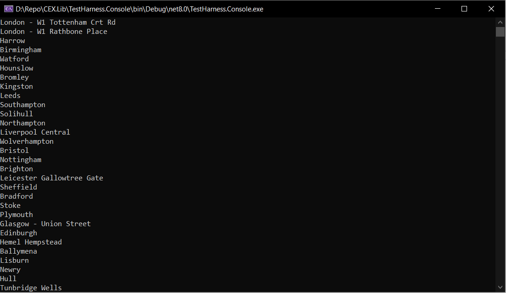
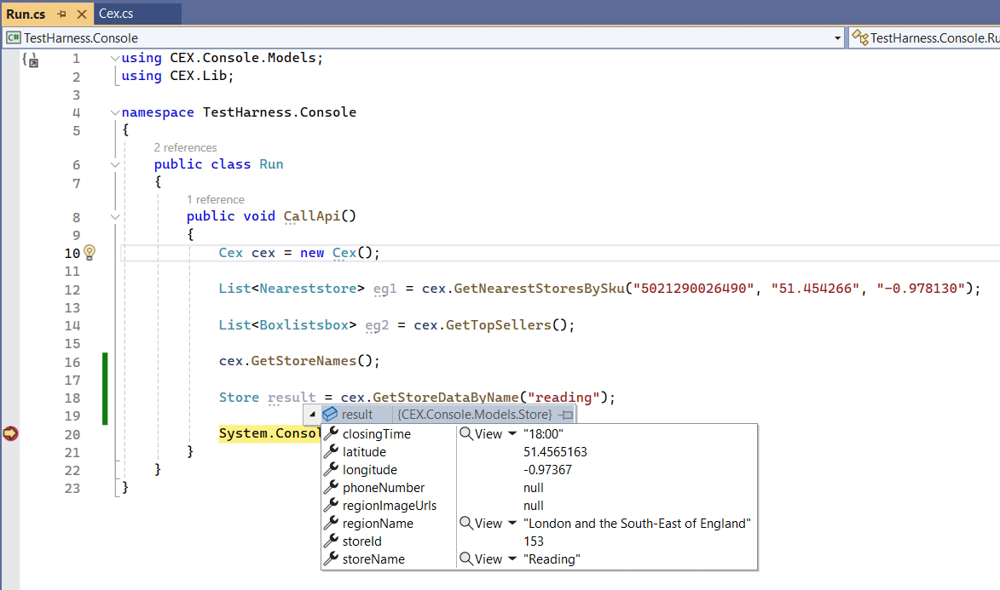
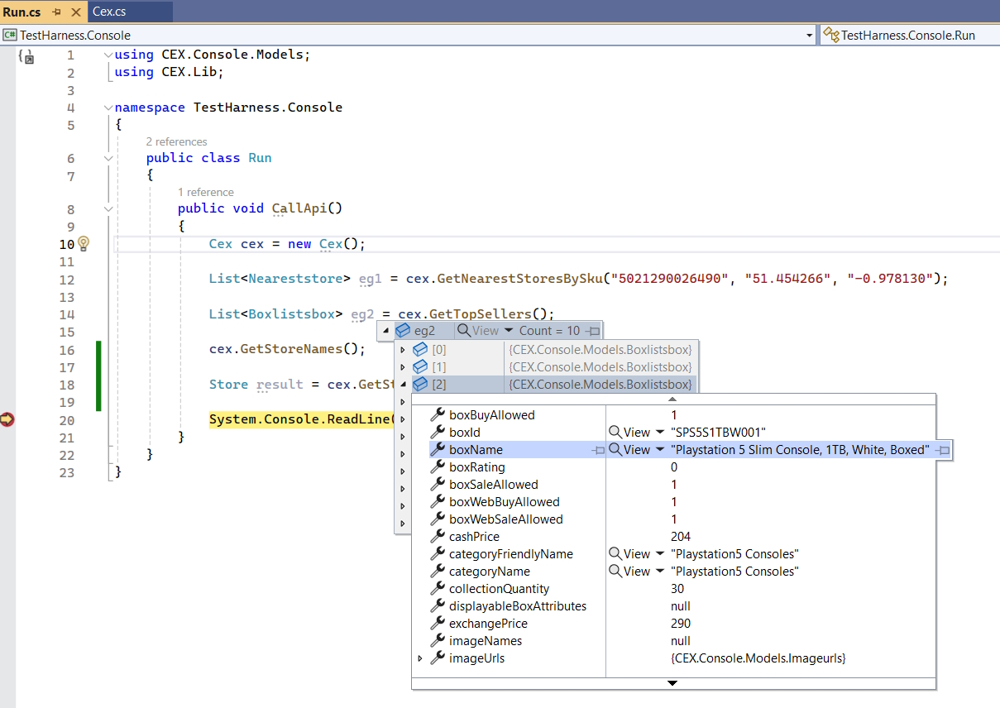

-----------------------------------------
14th May 2024:
-----------------------------------------

A class library project and console launcher used to demonstrate some of the capabilities of the REST based webuy (CEX) API.

The original goal of this project was to create an application that can track the stock level of products I am interested in at my local CEX branch.  However as of April 2024 some of the endpoints of the webuy API (github.com/Dionakra/webuy-api) are non-functional which has prevented this goal being achieved.

Technologies / Principles Used:

- C#
- REST
- NET Core (Console & Class Library)
- RestSharp
- Newtonsoft.Json

Resources / Credits:

- https://github.com/Dionakra/webuy-api
- https://github.com/martinsirbe/cex-stock-checker
- https://github.com/piotrpdev/WeBuy-Cex-Price-Tracker
- https://www.youtube.com/watch?v=qm29vYcYBeg

Images:

